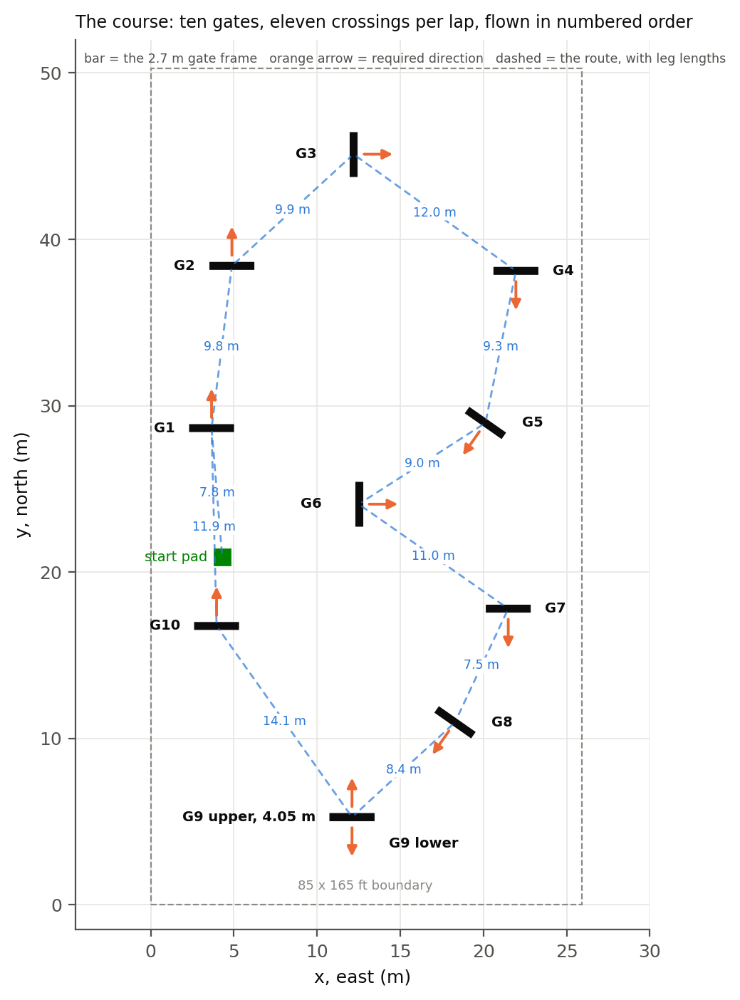

# aigp-sim

**The simulator and policy-training half of our entry to the AI Grand Prix physical qualifier** (Team Electric Fire; Anduril LC3, Santa Ana, 15–22 September 2026). An Isaac Sim / Isaac Lab / skrl PPO stack that trains a policy to fly the organizer's ten-gate hall course from projected gate corners plus IMU, and to hover in front of a gate. The policy emits four numbers, collective thrust and three body rates, which a Jetson Orin NX on the aircraft streams to a Betaflight flight controller over MSP.

The whole project, across all three repositories, is written up in **[the paper](paper/paper.md)** ([PDF](paper/paper.pdf), NeurIPS style).


*The pad start: the 40 Hz policy on the floor 7.4 m before gate 1, up and through it, in Isaac Sim ([race_start_from_pad.mp4](paper/videos/race_start_from_pad.mp4)). Before the spawn fixes this succeeded in 0 of 456 attempts.*


*The 40 Hz racing policy trained under measured corner dropout (`race40drop`) flying the course from the competition pad. 36 of 64 aircraft completed the first lap. Every path in blue, one aircraft coloured by height; right, height over the lap and when each gate was passed.*

## Results

| | | scored under |
|---|---|---|
| Racing, `race40` | **15.27 gates / episode** | perfect corners |
| Racing, `race40drop` | **10.23 gates / episode**; 36 of 64 first laps from the pad | corners dropping as the real detector's do |
| Hover, 40 Hz retrain | **85.5% settled** within 0.30 m, p95 excursion 0.331 m | the control rate the aircraft supports |
| Pad start to gate 1 | 0 of 456 before the start fixes, **86.3%** after | 256 pad starts |
| Full racing run | ~48 min, ~$0.70 | 4096 environments, RTX 6000 Ada |

Both racing checkpoints are in [`checkpoints/`](checkpoints/). Nothing trained here flew props-on; the paper's Sections 6 and 7 say why, and what the aircraft measured.

## What was built here

<picture>
  <source media="(prefers-color-scheme: dark)" srcset="paper/figures/dark/system_diagram.png">
  
</picture>

*The chain from camera to motors as it stood on 21 September, with the measured rate or latency on each link. Blue is telemetry back to the observation, orange the command path. The lower band is what the pilot owns.*

The simulator is a fork of [Kousheek Chakraborty's `isaac_drone_racer`](https://github.com/kousheekc/isaac_drone_racer); PPO is skrl's; the tasks follow Isaac Lab's manager pattern. What we built on top:

* **A hashed observation contract** (`contract/`) shared with the aircraft, so a channel-order mismatch is a refused checkpoint rather than a confident wrong flight.
* **A plant corrected from measurements**: 1745 g mass distributed across links, inertia estimated for the real airframe and its centre-of-mass tilt fixed, rate-loop gains derived rather than inherited, action delay and setpoint lag, a 30 Hz camera latch with a 1–4 step vision delay.
* **Corner dropout calibrated on the real detector** (13% missing, 0.81 sticky, measured over 1345 frames at a real gate), which is what `race40drop` trained against.
* **Starts that match the race**: on the floor at the competition pad, after two silent spawn bugs were found and fixed.
* **A smoke test that gates every training run** on a rented box, and bench diagnostics for checkpoints.

## The fallback: a classical perception stack

**Why we deferred the policy.** It had trained on perfect corners; the real detector left its observation intact 59% of the time. Its 1760 inputs had to match to the number, and three mismatches (gyro units, pitch sign, a 2.4× rate map) surfaced only in flight. It trained at 60 Hz on a 40 Hz link. It needs ACRO, where a fault means no self-levelling and a hand-flown abort. The first props-on attempt lasted 0.45 s, and each one risked one of four aircraft.

**What replaced it.** A deterministic stack in ANGLE mode, built from `pq/flight` and a small decision layer, `stack_min`:

- Eight corners give a gate pose by planar PnP; gravity from the flight controller rejects the mirrored solution, and its attitude replaces PnP's rotation (0.09 m error at 8 m, against 2.12 m for the full solve).
- Detections are matched to gates in metres; the closest two gates are 7.54 m apart.
- An alpha-beta filter carries position between fixes. Hover throttle is learned in flight. Blind, the stack can only sink; three seconds without a fix lands it.
- Guidance is a state machine: take off, stage 3.5 m out, hold until aligned, creep through at 1.2 m/s, hover and turn to the next gate. Lean capped at 15°, about 1 m/s.


*The stack in Isaac against a pessimistic sensor model (every gate detected, gate-shaped false positives, sticky corner dropout, latency, an unknown self-levelling gain), chase view above its own camera. 64 aircraft per configuration: the hover-and-turn after each gate took three-gate success from 84% to 95%; the gate-6 detour took that gate from 0 of 64 to 64 of 64. Section 7 of the paper has the full account, including its one flight, which hit the ceiling.*

## Documentation

1. [`paper/paper.md`](paper/paper.md): the whole effort in one document, figures and videos included.
2. [`docs/OBSERVATION.md`](docs/OBSERVATION.md): the 55-channel contract, the timing model, every environment variable.
3. [`docs/PLANT.md`](docs/PLANT.md): what the simulated aircraft is, number by number, and what is not modelled.
4. [`docs/TRAINING_RESULTS.md`](docs/TRAINING_RESULTS.md): every result with its checkpoint and commit.
5. [`docs/RUNBOOK_RUNPOD.md`](docs/RUNBOOK_RUNPOD.md): how to run this on a rented GPU, with the failure catalogue from the first attempt.

## Usage

```bash
python -m pytest -q                                   # 256 pass, no Isaac needed
python scripts/smoke_test.py --headless               # the plant on live PhysX; prints SMOKE_RESULT=
python -u scripts/rl/train.py --task Isaac-Drone-Racer-v0 --headless --num_envs 4096
python scripts/rl/play.py --task Isaac-Drone-Racer-Play-v0 --num_envs 1 --real-time --checkpoint <run>/checkpoints/best_agent.pt
```

Tasks: `Isaac-Drone-Racer-v0` (racing) and `Isaac-Drone-Hover-v0` (station keeping 2 m in front of a gate), each with a `-Play-v0` variant that enables the camera and starts in front of official gate 1. On a rented box use `scripts/pod/train_launch.sh`, which runs the smoke test as a gate first. To film a checkpoint with the chase view beside the onboard camera, `scripts/diag/record_race_pov.py`, or on a Windows machine with the Isaac venv, `scripts\windows\record_race_pov.ps1` end to end.

## The aircraft and the course

The drone is **not** a 5-inch racing quad. It is the organizer-supplied Neros Archer B2: 8-inch props at 4.1 pitch, Betaflight 4.4.3 on an H743 board, a Jetson Orin NX 16 GB, **1745 g** all-up race weight measured on site. The `assets/5_in_drone/` USD and its 0.6 kg URDF are geometry inherited from upstream; mass, inertia and thrust are overridden at startup to this airframe ([`docs/PLANT.md`](docs/PLANT.md)).

The course is ten gates from the organizer's coordinate table; gate 9 is a stacked double gate flown through twice per lap, so a lap is **11 crossings** and a scored two-lap run is 22. The simulator's 11 track entries are those crossings.

<picture>
  <source media="(prefers-color-scheme: dark)" srcset="paper/figures/dark/course_map.png">
  
</picture>

*The course as the simulator has it, from the organizer's coordinate table: gate frames, required direction, the route with leg lengths, and the start pad.*

## Layout

```
contract/     the observation vector, camera and plant constants, and the hash of them
tasks/        Isaac Lab envs: drone_racer/ (scene, track, rewards, terminations,
              the plant in mdp/actions.py, spawn distribution in mdp/commands.py)
              and drone_hover/ (a subclass); agents/skrl_cfg.yaml is PPO
dynamics/     action decode, thrust curve, rate loop, gains derived from inertia
utils/        the torch observation builder, camera latch and delay line,
              commanded-velocity integrator, gate counter, play HUD, logging
assets/       drone and gate USD (Git LFS); the gate is built by tools/
checkpoints/  race40 and race40drop, the two the paper reports, with provenance
scripts/rl/   train.py, play.py, diagnose.py
scripts/diag/ checkpoint diagnostics: spawn, takeoff, collisions, robustness,
              hover stress, video recorders
scripts/pod/  RunPod launchers, chains, sweeps, checkpoint puller
scripts/      smoke_test.py, bench_throughput.py, windows/
tools/        gate asset builder, field-measurement worksheet
tests/        256 tests that run without Isaac; one module needs the training box
docs/         the five documents above, plus the first smoke run's findings
paper/        the write-up, its figures, videos and build scripts
```

The package names (`contract`, `tasks`, `utils`, `dynamics`, `assets`) are deliberately unchanged from the vendored `isaac_drone_racer` tree. They are imported by name from the pod scripts, from the flight repo's vendored copy of `contract/`, and from the perception-stack simulator on the `perception-sim` branch of the flight repo; renaming them would break every one of those for a cosmetic gain. Isaac Lab itself does not care: the gym ids are registered from `tasks/__init__.py` by whatever the package is called.

## The observation contract

<picture>
  <source media="(prefers-color-scheme: dark)" srcset="paper/figures/dark/observation_contract.png">
  
</picture>

*The observation as the policy receives it: one row per frame, 32 deep, one column per channel, coloured by where the channel comes from.*

`utils/aigp_obs.py` here and `race_obs.py` on the aircraft are two implementations of one observation vector, and if they disagree by a channel order or a clip nothing raises: the policy flies confidently on numbers that mean something else. So `contract/` defines the vector, the camera and the plant constants once, with no dependencies, and hashes every value both ends must agree on (v2, the current contract: `a20c14d6a335`, 55 channels × 32 frames = 1760). `train.py` stamps the hash into every run as `contract.json` and `play.py` refuses a checkpoint whose stamp disagrees with the running code.

## Install

Git LFS **before** the first clone, or the 98 MB drone USD arrives as a pointer file and Isaac fails with an unhelpful error:

```bash
git lfs install
git clone https://github.com/bojro/aigp-sim && cd aigp-sim
python -m pytest -q          # 256 passed, without Isaac
```

Isaac Sim 4.5, Isaac Lab 2.1.0 and **skrl 1.4.2** (not 2.x; Isaac Lab 2.1 uses the 1.x runner API). The tests need only torch and pytest. Two requirements:

* **The A100 is the wrong card.** GA100 is the one Ampere die without RT cores and Isaac Sim needs a Vulkan device even headless. L40S, RTX 6000 Ada, A10G or a 4090 all work.
* **On Linux, export `LD_LIBRARY_PATH`** (WSL: `/usr/lib/wsl/lib`) before training, or PhysX cannot find `libcuda.so`, silently falls back to the CPU solver, and runs ~100× slower while appearing to work.

## What is and is not modelled

* **Latency is modelled**: 0–2 policy steps of action delay, a first-order lag on the rate setpoint matching the FC's measured 15 Hz setpoint filter, and a 1–4 step vision delay behind a 30 Hz camera latch, all randomised per episode.
* **Corner dropout is calibrated**; corner *misplacement* (`AIGP_KP_JITTER_PX`) is not, and defaults to 0.
* **Mass is measured; inertia is estimated** and not randomised.
* **No motor model.** Thrust and moments apply directly; the rate loop is slower than a real Betaflight loop, in the conservative direction.
* **The policy rate matters.** The Jetson closes the loop at 40 Hz; a 60 Hz policy loses a third of its settled time there. Both tasks accept `AIGP_POLICY_HZ` / `AIGP_HOVER_HZ` to train at the rate they will fly.

<picture>
  <source media="(prefers-color-scheme: dark)" srcset="paper/figures/dark/rate_40_vs_60.png">
  
</picture>

*Left: hover settled fraction for the 60 Hz checkpoint and the 40 Hz retrain, each run at both rates. Right: the 60 Hz racing checkpoint at both rates.*
* **Three asset files are broken LFS pointers** whose content is gone from the upstream remote. Nothing loads them ([`assets/BROKEN_LFS_OBJECTS.md`](assets/BROKEN_LFS_OBJECTS.md)).
* **Nothing here exports to the Jetson.** The NumPy export of a checkpoint and the runner that flies it live in the flight repo under `pq/flight/onboard/`.

## Recordings

| file | what it shows |
|---|---|
| [`race_best.mp4`](paper/videos/race_best.mp4) | an early chase-camera recording from before the start fixes; that checkpoint had not trained a takeoff from this position and the run does not complete the course. To be replaced by a recording of `race40drop` with its own camera view |
| [`race_start_from_pad.mp4`](paper/videos/race_start_from_pad.mp4) | the 40 Hz policy taking off from the competition pad and through gate 1, 6.7 s |
| [`stack_run_01.mp4`](paper/videos/stack_run_01.mp4), [`02`](paper/videos/stack_run_02.mp4), [`03`](paper/videos/stack_run_03.mp4) | the classical fallback stack, chase view above its own camera with detections, 60 s each |

A recording of the current policy (`race40drop`) racing, side by side with its own camera view, is not made yet; `scripts/diag/record_race_pov.py` produces it on any machine with Isaac Sim (`docs/HANDOFF_WINDOWS_RECORDING.md`).

## The other two repositories

* [`bojro/aigp-perception`](https://github.com/bojro/aigp-perception): the gate-corner detector, its labelling pipeline and the two shipped models.
* [`Code-Red-Cables/AI_GP`](https://github.com/Code-Red-Cables/AI_GP) (private): the flight client, the MSP runner and the on-site work under `pq/`.

## Lineage and licence

Forked from Kousheek Chakraborty's [`isaac_drone_racer`](https://github.com/kousheekc/isaac_drone_racer) (BSD-3-Clause, `LICENSE`) via our `AI_GP/isaac_drone_racer/`, and split out on 20 September 2026 because a rented GPU box should clone the thing it is going to run, not 1.5 GB of run logs, the flight client and the competition PDFs. We are Team Electric Fire: Bojro Das, Geneustace Wicaksono, Etienne Sasenarine, John Apessos, Grant Lin, Rocky Shao.
