# Vision-Only Autonomous Drone Racing on Borrowed Hardware: What Team Electric Fire Built for the AI Grand Prix Physical Qualifier, and What the Aircraft Taught Us

**Bojro Das, Geneustace Wicaksono, Etienne Sasenarine, John Apessos, Grant Lin, Rocky Shao**
Team Electric Fire (Team 10), AI Grand Prix Physical Qualifier, Anduril LC3, Santa Ana, California, 15–22 September 2026

*Draft of 22 September 2026. Author order is provisional pending the team's agreement.*

Code: [bojro/aigp-sim](https://github.com/bojro/aigp-sim) (simulation and policy training), [bojro/aigp-perception](https://github.com/bojro/aigp-perception) (gate perception), [Code-Red-Cables/AI_GP](https://github.com/Code-Red-Cables/AI_GP) (flight client and on-site work, private).

---

## Abstract

The AI Grand Prix physical qualifier hands each team four identical 8-inch quadcopters and asks for two autonomous laps of a ten-gate course: one forward camera, the flight controller's own inertial sensors, no external positioning, and no human input once a scored run begins. This paper reports what Team Electric Fire built for it and what happened when the system met the aircraft. Over four months the team went through three generations of approach. Classical colour-and-geometry vision with hand-written planners carried the virtual qualifiers. Imitation learning from human laps followed. For the physical event we trained a reinforcement-learning racing policy in NVIDIA Isaac Lab against a plant model of the real aircraft and fed it with a YOLOv8-pose gate detector fine-tuned on hand-labelled frames from the aircraft's own camera. In simulation the final 40 Hz policy passed 15.3 gates per episode with perfect corner observations and 10.2 once corners dropped out the way the real detector's do. A separately trained hover policy settled within 0.30 m in 85.5% of episodes at the control rate the aircraft can actually sustain. On the aircraft itself we measured what a sim-to-real transfer rests on rather than assuming it. The shared 115200-baud telemetry link caps the control loop at 40 Hz. The gyro reports raw counts, 16.384 per degree per second. Pitch is inverted relative to the simulator. Betaflight's rate curve turns the shipped linear stick map into a loop gain that climbs from 0.62 to 2.40 across the working range. The barometer reads a descent whenever the propellers spin. A keypoint threshold nobody had set was discarding two frames in three. The week ended without a scored run: flight-controller wedges, ground strikes and two autonomous strikes, one into a wall and one into the ceiling, used up the fleet before an autonomous hover had been demonstrated. We set down the methods, the measurements and the sequence of events so that the next attempt, ours or anyone's, can start where this one finished.

---

## 1. Introduction

Drone racing compresses perception, state estimation and control into a few seconds of flight. The best published systems now beat human champions [1]. They also enjoy motion-capture-grade state estimation during training, custom airframes with characterised dynamics, and months on a single platform. The AI Grand Prix physical qualifier strips each of those away on purpose. A team receives four aircraft it did not build, a companion computer with no deep-learning framework installed, a flight controller it may not fully configure, a hall without a tracking system, and five working days.

What follows is one team's record of that week and the four months before it. We have written it as a research report rather than a post-mortem for two reasons. Most of the work is reusable. And most of the measurements are new: until now nobody had written down, for this aircraft, how fast its telemetry link is, what units its gyro speaks, or how badly its rate curve distorts a policy's commands. There is a third reason, too. The attempt fell short of a scored run, and the reasons are specific, ordered and, with hindsight, addressable.

A word on what is original here, because most of the parts are not. The simulator is a fork of an open drone-racing project; the policy is standard PPO; the detector is an off-the-shelf pose model; the controllers on the virtual qualifiers were textbook. What the team built on top of those is smaller and more specific: a geometric labeller that gets ring identity from image topology, a hashed observation contract shared between simulator and aircraft, a corner-dropout model calibrated on the real detector, a plant corrected from measurements rather than a datasheet, and a set of bench measurements on this aircraft that nobody had made. This document is written in the shape of a research paper because that shape forces the numbers, the methods and the failures onto the same page. It is a record of what a small team can build in four months and where the engineering held and gave way, not a claim of novelty.

We claim four contributions.

1. **A perception pipeline** that bootstraps gate-corner labels from the gate's own geometry, lets a detector propose where geometry cannot trace, and then replaces both with human labels once the self-scored accuracy turns out to be optimistic by a factor of six (Section 4).
2. **A simulation and training stack** built around an explicit, hashed observation contract shared by simulator and aircraft, with a plant model whose mass is measured and whose rate-loop gains are derived, latency and vision-delay modelling, and a corner-dropout augmentation calibrated on the real detector (Section 5).
3. **Bench measurements on the real aircraft** settling the control rate, the gyro scale, the axis conventions and the stick mapping. At least one runner had assumed each of them wrongly before it was measured (Section 6).
4. **A documented sequence of events** from working simulator to the end of the week, with the hardware incidents in order (Section 7), an engineering retrospective on the software-to-hardware seam (Section 8), and the lessons we would carry into a second attempt (Section 9).

## 2. The competition, the course and the aircraft

### 2.1 Rules that shaped the design

Under the physical qualifier specification (VADR-TS-005) a valid run is two laps flown "without any intervention of human pilots". Teams are ranked first by gates passed and then by elapsed time to the last valid gate; the best result of the final two days counts. Each team is assigned four aircraft. The organizers' repair desk maintains and charges them, and teams are not financially liable for damage. A training cage with manual piloting is available on top of timed track slots. Nowhere in the building is there motion capture, GPS or any other external tracking, so any measurement procedure that needs a ground-truth position is out.

The scoring rule matters more than it looks. Gates count first and time second. A slow policy that passes two gates therefore beats a fast one that passes one and crashes, and the team's plan for the last day was built on exactly that: not a lap, but "passing one or two gates from the competition start pad".

### 2.2 The course

Ten identical gates stand inside an 85 × 165 ft boundary, 25.9 by 50.3 m. Each is a square orange annulus, 2.7 m outside and 1.5 m across the opening, with the opening centred about 1.35 m off the floor. Gate 9 is a stacked pair: the upper opening, at roughly 4.05 m, is flown southbound and the lower one northbound. A lap is therefore 11 crossings and a run is 22. The organizers publish the gate coordinates. Our simulator track had been digitised from a drawing instead, and it turned out to be 6.5% too small with two headings wrong. Figure 1 shows the discrepancy; Section 5.4 puts a number on what it cost.

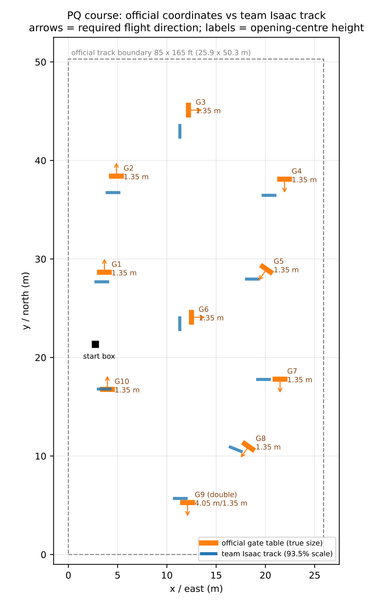

*Figure 1. The official gate table (orange, true size, with required flight direction and opening height) against the team's original Isaac track (blue), which had been digitised from a picture at 93.5% scale. The start box is on the floor, 7.4 m before gate 1.*

### 2.3 The aircraft

The supplied aircraft is a Neros Archer B2. It carries 8-inch propellers at 4.1 pitch, weighs 1745 g ready to race (we put it on a scale on 17 September), runs on a 6S pack, and spins four DShot300 motors that report their RPM back. The flight controller is Betaflight 4.4.3 on an STM32H743 with an ICM42688P gyro and a DPS310 barometer. Beside it sits an NVIDIA Jetson Orin NX 16 GB on a Seeed A603 carrier, held to a 25 W budget. Its image ships OpenCV with GStreamer, NumPy and pyserial, and by the organizers' design nothing else: no PyTorch, no TensorRT in the system Python. The camera is a 12.3 MP Arducam IMX477 behind an M12 lens, rolling shutter, which the team tilted 20° upward and locked. We captured at 1920×1080 and ran inference at 640×360. Three independent calibrations of the lens agree on a horizontal field of view of 73.7–74.1°, about 425 px of focal length at 640 px width; the specification's nominal 75° is close but not the same.

One 115200-baud UART joins the Jetson to the flight controller, speaking the MultiWii Serial Protocol (MSP). Telemetry requests go out on it. So does the stick stream whenever the Jetson is flying. What sharing costs is the subject of Section 6.1.

### 2.4 The handover mechanism

Betaflight's *MSP override* lets a companion computer stand in for selected radio channels, streaming values over MSP for as long as an auxiliary switch is held. On our aircraft the override mask was 15 (roll, pitch, throttle and yaw). The override mode sat on AUX5, down position engaging the policy. ARM stayed on AUX1 under the pilot, and ANGLE, the self-levelling mode, on AUX2. Three facts about the firmware shaped every runner the team wrote. We read them in the 4.4.3 source and later confirmed each on the aircraft.

- MSP stick data has **no timeout**. A process that stops streaming leaves the flight controller flying the last frame it received, indefinitely.
- The MSP stick buffer starts at **zero**, and zero looks to the receiver logic like a dead radio: RX_FAILSAFE after 0.3 s, motors cut after 5 s, and the AUX channels frozen so that the override switch itself can no longer be seen. Valid frames have to be streaming before anyone touches the switch.
- The override mask has **no MSP route**. Only the Betaflight command-line console can set it, and on this board the console wedged the flight controller on both of the two occasions it was tried, 18 September. It was banned outright from then on.

## 3. System overview and the three generations of approach

Every autonomous racer runs the same loop. Find the gates in the image; estimate your own motion; decide; actuate. Over the summer the team built that loop three different ways (Table 1), and the system taken to the physical qualifier borrowed from each.

| Period | Approach | Outcome |
|---|---|---|
| Jun 2026 | Organizers' example client on the virtual qualifier; HSV colour mask for the orange opening; PnP range; attitude-rate controller over MAVLink | Passed the first gate on 6 June; a waypoint replay completed the course "sub 14 seconds" using the simulator's own position |
| Jul 2026 | Virtual qualifier 2 removed position telemetry. YOLO corners + IMU dead reckoning (`Q2_pnp`, passed gates 1–2); a 16-state dual-gate EKF (`Q2_kalman`); a DreamerV3 world model (168k steps, zero gates, deleted) | No autonomous lap; human personal best 35.96 s |
| Aug 2026 | Li & de Croon style classical stack; a snake-gate detector; HG-DAgger imitation of 17–18 human laps with a temporal-convolutional policy | Human best 14.04 s; the imitation policy "leaves the pad and will crash" |
| 30 Aug–16 Sep | Isaac Lab PPO on a digitised copy of the physical course; keeper checkpoint `pq_speed_best` at 33 gates per 40 s episode | Fast but brittle (Section 5.4); abandoned on the corrected simulator |
| 17–22 Sep | On site: MSP adapter, bench measurements, hand-labelled gate detector, 40 Hz retrains with dropout, three hover runners, a classical "stack_min" fallback in simulation | No scored autonomous run; all four aircraft grounded (Section 7) |

*Table 1. The eras of the project. The branch names in the archived repository match the middle column.*

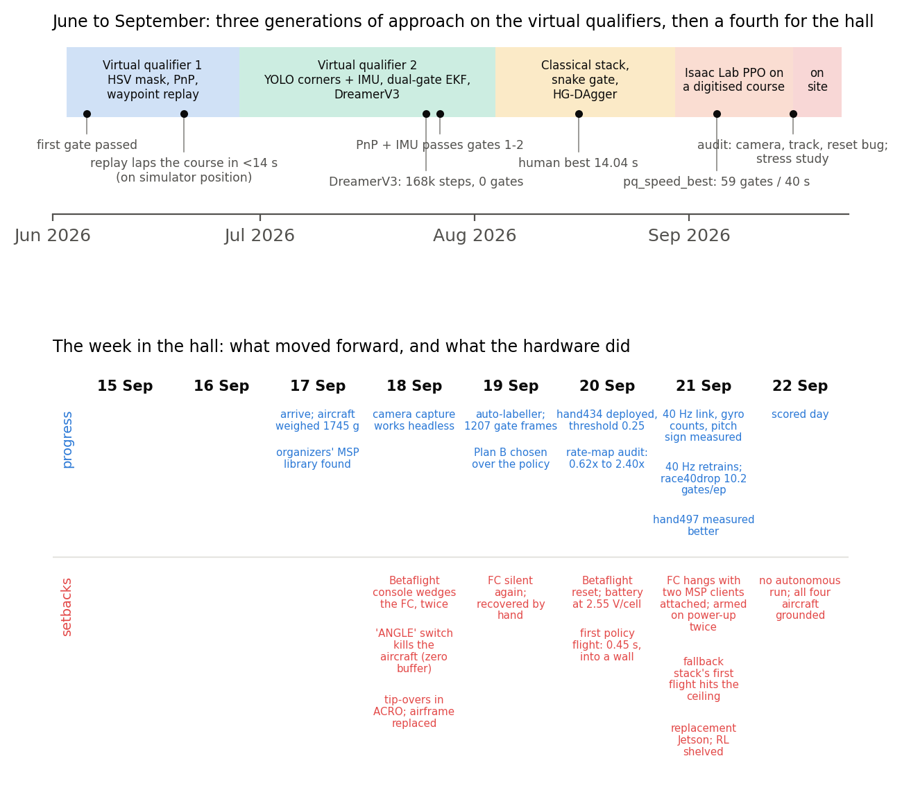

*Figure 2. Four months and one week. Top: the eras of Table 1 with the milestone each one reached. Bottom: the physical-qualifier week day by day, progress above the line and setbacks below, from the commit history and the session notes.*

Here is the physical-qualifier system end to end. The camera delivers frames at 30 fps. A YOLOv8n-pose detector places the eight corners of every visible gate. Those corners, together with roll, pitch and body rates from the flight controller and a dead-reckoned body velocity, are packed into a fixed-width observation history. A NumPy multilayer perceptron, exported from the trained checkpoint, maps that history to a collective-thrust value and three body rates. An adapter converts the four numbers into RC channel values by inverting Betaflight's rate and throttle curves, and streams them at 40 Hz. Because nothing on the real course announces which gate comes next, a gate tracker keeps count. Alongside all this ran a classical stack, `stack_min`, as the slow fallback: the same detector, a perspective-n-point pose, an alpha-beta position filter and a stop-and-go guidance cascade in ANGLE mode.

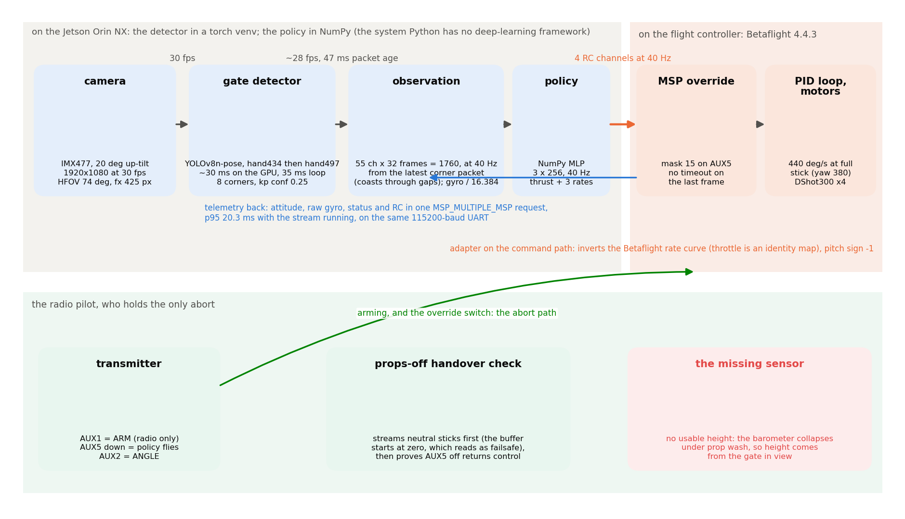

*Figure 3. The chain from photons to motors as it stood on 21 September, with the rate or latency measured on each link. Blue is telemetry back to the observation; orange is the command path, where the sign, scale and curve findings of Section 6 lived. The lower band is the part of the system the pilot owns: arming and the override switch are the only abort, and the props-off handover check is the test that proves they work. The box on the right is the sensor the aircraft did not have.*

## 4. Perception: eight corners of an orange square

### 4.1 The problem

The gate is a planar orange ring. Eight keypoints describe it, four outer and four inner, clockwise from top-left with a fixed left-right flip index, and once four of them are visible a perspective-n-point solve gives the pose. The detector has to run inside 33 ms on the Orin. It has to keep working as the gate fills the frame and spills past its edges on approach. And it must not mistake the sponsor banners and signage, printed in the same orange, for gates. When the team arrived on site no detector had ever seen a real gate. The existing models had been tuned on simulator renders; the only footage of a real gate came from a teammate's phone.

### 4.2 Data

On 19 September a teammate carried the aircraft's own camera around a gate in the hall. That walk produced 1207 frames at 2 fps in two sessions, 1920×1080, with hardware capture timestamps. Another 331 frames came from the aircraft near a gate on 20 September, close-ups among them where the ring runs off the edge of the picture (Figure 2b). Flight footage does not exist. Every training image is a person walking.

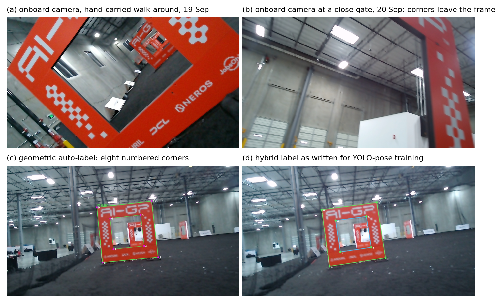

*Figure 4. What the onboard camera sees. (a) A walk-around frame from 19 September. (b) A frame from the aircraft on 20 September at a close gate; the corners the policy needs are outside the image. (c) The geometric auto-labeller's output, eight numbered corners. (d) The same gate as a hybrid label written for YOLO-pose training.*

### 4.3 Geometric auto-labelling

Hand-labelling eight ordered corners on a thousand frames was not an option on the first day. So the team wrote a labeller that measures the gate rather than recognising it. A colour mask of the ring has a hole in it. In the contour hierarchy the parent is the outer square and the child hole is the opening, so ring identity falls out of topology; there is no need to tell eight similar corners apart. After that it is measurement. Fit lines to the sides. Intersect consecutive sides to get corners, which also recovers corners lying past the frame edge. Refine each side to the image's own colour step at sub-pixel resolution. Fit a single homography to all eight points, an over-determined problem that pulls both rings onto a geometrically exact gate. A corner counts as visible only if both of its sides were measured. When a frame's largest orange blob yields no label at all, the frame is quarantined rather than written as a negative, so a missed gate can never become a "no gate here" training example.

Run over the 1207-frame capture, the labeller accepted 1026 gates across 816 images and sent about a third of instances to review. Scored against itself, its median corner offset from the image's own edge was 0.75 px.

### 4.4 The hybrid, and why confidence cannot replace geometry

A teammate's detector, trained earlier on Roboflow-labelled frames, had a complementary profile. On frames it had never seen it missed 0 of 127 geometrically verified gates, but it placed corners only to about 3.8% of gate size. The geometry placed them to 0.2%, yet only where it could trace them. The obvious marriage: the detector proposes, the geometry disposes. Each proposal is refined to the image's edges and passed through the same per-corner checks the labeller applies to its own work. About 170 extra gates per 200 frames survived that, at the same accuracy, lifting the accepted total from 1026 to 1917. Could the detector's own confidence have done the same job? No. Recovered proposals scored 0.53 and rejected ones 0.56, no separation at all.

Fine-tuning `yolov8n-pose` on the hybrid labels, and scoring on held-out contiguous blocks of frames, raised box mAP50-95 from 0.283 to 0.636 and pose mAP50-95 from 0.760 to 0.854. Recall on verified gates went from 98% to 100%, and keypoint error against the geometry fell from 11.8 to 8.3 px (Figure 5, left). Simulated motion blur out to about 215°/s of yaw barely touched recall.

The split deserves a paragraph of its own. Frames arrive half a second apart along a walked path, so neighbours are near-duplicates, and a random train/validation split scores the model on what it memorised. One model, scored both ways, reads 0.517 box mAP50-95 on a random split and 0.283 on contiguous blocks (Figure 5, centre). Every accuracy figure quoted inside the team before this point, a reported 0.90 mAP included, had used a random split.

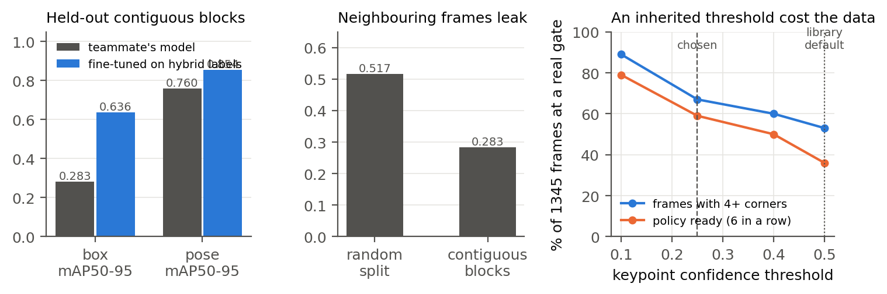

*Figure 5. What decided the detector. Left: the fine-tune against the incumbent on held-out contiguous blocks. Centre: the same model scored on a random split and on blocks. Right: the keypoint-confidence threshold below which a corner is reported invisible, measured over 1345 frames at a real gate on 21 September; the library default of 0.5 against the 0.25 chosen at the gate. The gate itself was detected in every frame at every setting.*

### 4.5 Human labels, and the number that was wrong

A Roboflow export of human annotations arrived partway through the week: 340 frames and 737 gate instances at first, 497 frames later. For the first time the labeller could be checked against something other than itself. The verdict was **4.36 px median, 9.64 px at the 90th percentile**, not 0.75 px. The old figure had been measured against the gate's own geometric model, the very thing the labeller solves for, and a systematic error fits that perfectly. Some of the gap is a person clicking on a corner at 1920×1080; the true error sits between the two numbers, nearer the top. Sub-pixel was never a claim the team could make, and the documents were corrected to say so.

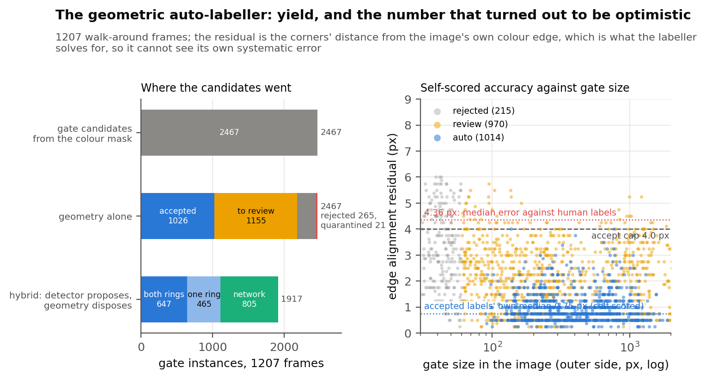

*Figure 6. The geometric auto-labeller on the 1207-frame walk-around capture. Left: its 2467 gate candidates and where each went, then the hybrid's yield. Right: every candidate's edge-alignment residual against its size in the image. The residual is the corners' distance from the image's own colour edge, which is what the labeller solves for, so the blue median is the labeller scoring itself; the red line is what human labels later measured. The gap between them is the systematic error a self-score cannot see.*

Two models came out of the human labels, `gate_pose_hand434` and `gate_pose_hand497`: 150 epochs, batch 64, seed 0, vertical flips off because a vertical flip silently swaps top and bottom ring identity. On 67 held-out human-labelled frames the hand-labelled model found 32 of 32 close gates (those larger than 30% of the frame). The incumbent found 23. The incumbent also stacked nested duplicate boxes on a single close gate, seven detections for two gates in one checked frame (Figure 7). That is a flicker source no temporal filter can remove, because the duplicate that wins non-maximum suppression changes from frame to frame. Before hand497 could be trained at all, three silent data faults had to be found. Roboflow splits three ways and the builder read only the training split, which would have thrown away 115 of the 497 labels. Fifty-eight labelled frames lived in a different capture directory. And macOS `tar` had scattered 2617 AppleDouble `._*` files through the upload, which Python's `glob` would have scanned as corrupt images.

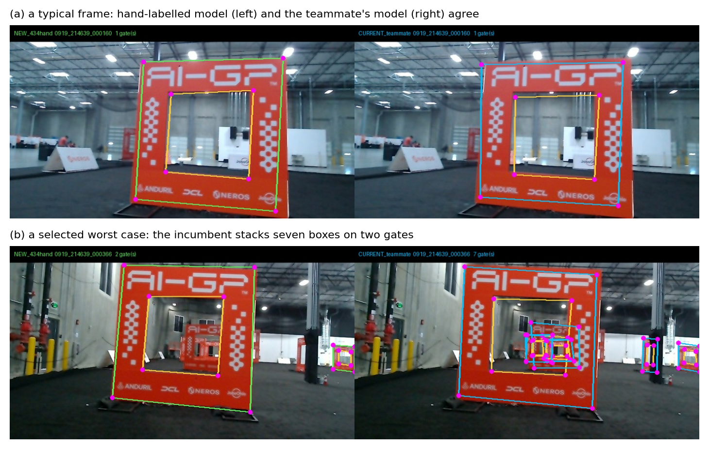

*Figure 7. Side-by-side on the same frames: the hand-labelled model (left panes) and the incumbent (right panes). (a) A typical frame where both find the one gate. (b) A selected worst case, not a fair sample: the incumbent reports seven gates.*

### 4.6 On the aircraft

On the Orin, either model takes 27.4–27.6 ms per 640×360 frame on the GPU at the 25 W profile, 36 fps. FP16 changed nothing measurable. The whole producer loop from capture to published corners ran at 35.4 ms, and a 40 Hz consumer saw a mean packet age of 47 ms. Two models on one frame cost about 61 ms. The always-both dual-detector mode (Figure 8) therefore could not fly; the side-by-side comparison on the Orin was a viewing tool.

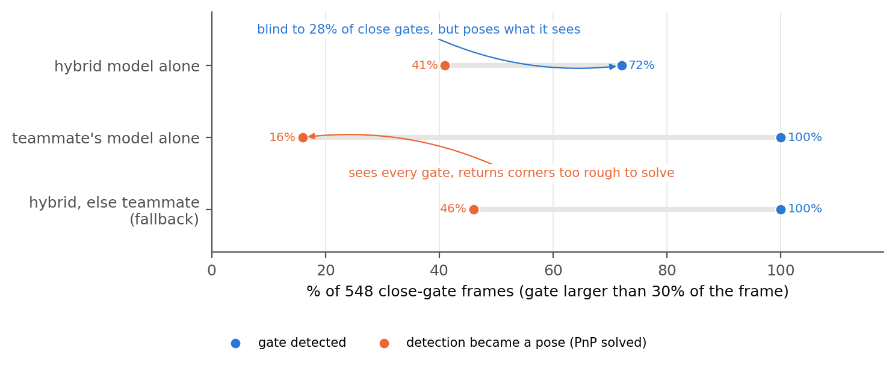

*Figure 8. Close gates are the ones flown through, and the two models fail in opposite directions. On the 548 close-gate frames of the walk-around capture (laptop CPU, 640×360): blue is the gate being found, orange is its corners being good enough for a pose. The hybrid model is near-blind to 28% of close gates but poses what it sees; the teammate's model sees every gate and returns corners too rough to solve; the combination beats both.*

Two findings at a real gate on 21 September mattered more than which model flew. The first concerned a threshold. Below some keypoint confidence a corner is reported as invisible, and nobody had ever set that value, so the library default of 0.5 was in flight. The runner needs four visible corners, and any frame that falls short wipes its six-frame history. At 0.5, then, the policy could act 36% of the time. At 0.25, checked by eye at the gate, it could act 59% of the time (Figure 5, right). The second finding compared the two models over 1345 frames at that threshold. hand497 flickered 30% less, 4.2% against 6.0% per-corner flips between frames. It broke into half as many usable fragments, 37 against 78, and its longest unbroken run was 178 frames against 142. Those per-corner statistics, a 13% dropout rate with 0.81 stickiness, became the dropout model the racing policy was retrained against (Section 5.6).

Two more fixes applied to whichever model flew. The pose solver's reprojection-error cap of 2.0 px suited the simulator's exact corners; on real frames it rejected 74% of the gates the model found, against 33% at 8 px, and the looser cap added no range jitter. And the aim point, taken as the average of whichever corners were visible, slid off the hole and onto the frame the moment the inner corners left the image, 11–47% of the gate's width off. That happens exactly as the aircraft closes.

## 5. Simulation and policy training

### 5.1 The stack

The training stack forks Kousheek Chakraborty's `isaac_drone_racer` on Isaac Sim 4.5 and Isaac Lab 2.1, with skrl 1.4.2 PPO [5, 6, 7]. Its shape: 4096 environments, 120 Hz physics, a policy step every second physics step (60 Hz) or every third (40 Hz), a shared three-layer 256-unit ELU trunk under a Gaussian head, 24-step rollouts, five learning epochs, an adaptive learning rate on a 0.01 KL threshold, and running standardisation of observations and values. A full 50 000-timestep racing run at 4096 environments takes about 48 minutes on an RTX 6000 Ada and costs under a dollar. Compute was never the constraint on this project.

### 5.2 The observation contract

There are two implementations of one vector: a batched torch builder in the simulator and a NumPy builder on the aircraft. Keeping them separate was deliberate, since forcing both through one implementation would make both worse. What must never differ is the definition. If the two disagree by a channel order or a clip, nothing raises. The policy simply receives numbers whose meaning has drifted and flies into a gate with total confidence. So the repository defines the contract once, in dependency-free Python, and hashes every value both ends must agree on. The aircraft-side assembler reproduces the simulator's 1632-number history exactly, with projection agreeing to 3.9 × 10⁻⁶ px, and the NumPy policy runtime matches PyTorch to 2.5 × 10⁻⁶.

Version 1 of the per-frame vector has 51 channels: 16 normalised pixel coordinates for the target gate's eight corners (−1 when unseen), 8 visibility flags, gravity-referenced roll and pitch, three body rates clipped to ±8 rad/s, three components of commanded body velocity, an 18-slot one-hot naming the next gate, and a lap fraction. Thirty-two frames stack to 1632 inputs. Version 2 appends the four actions the policy last issued, 55 × 32 = 1760. Why? Latency. With no delay a policy can infer what it commanded from what happened next, and action history is redundant. With 40 ms of real delay it is not. The published ablation the team leaned on [8] saw trajectory tracking fall from 10/10 to 0/10 when action history was removed while delay was still simulated.

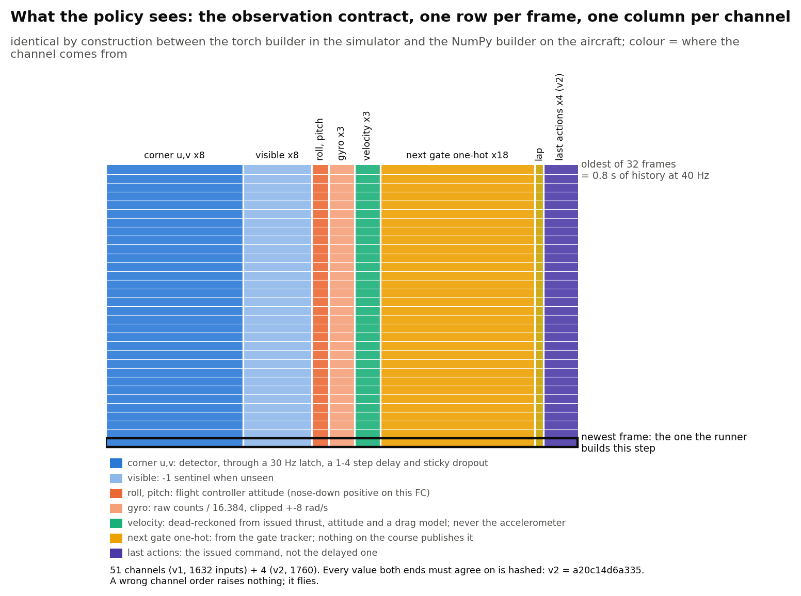

*Figure 9. What the policy sees. The observation as the policy receives it: one row per frame, thirty-two frames deep, one column per channel, coloured by where the channel comes from. The bottom row is the frame the runner builds this step; everything above it is history. The layout is identical by construction between the torch builder in the simulator and the NumPy builder on the aircraft.*

Three choices in that vector are worth defending. The velocity is *commanded*, dead-reckoned from thrust, attitude and a drag model, and never integrated from the accelerometer, because vibration biases this airframe's accelerometer low by about a third of a g at full throttle. The corners are latched at the camera's 30 Hz and then delayed by one to four control steps per environment, so the policy sees perception arrive the way the aircraft delivers it. And the action fed back is the *issued* command, not the delayed one. The aircraft knows what it sent the instant it sends it; feeding back the delayed command would hand the delay to the policy as free information.

### 5.3 The plant

The upstream simulator modelled a 0.6 kg 5-inch racing quad. The physical aircraft is 2.9 times heavier with arms roughly 2.2 times longer. Setting the mass sounds like the fix and changes nothing, because thrust in the simulator is normalised by mass and the mass cancels. Thrust-to-weight, rotational inertia and drag do not cancel. The corrected plant therefore does several things at startup. It distributes 1.745 kg across the airframe and four propeller links; the first attempt had applied 1.745 kg to *every* link, an 8.7 kg aircraft with a thrust-to-weight ratio of 0.2, which the smoke test caught. It writes an estimated inertia of (0.0040, 0.0055, 0.0075) kg·m² along with a corrected centre-of-mass orientation, after a read-back exposed a 7.16° authoring tilt in the asset that had been coupling roll into yaw. It derives the rate-loop gains from that inertia and a target time constant instead of inheriting them; the inherited gains had made the corrected aircraft 84% slower in pitch, and 73% of its crashes were gate strikes. It pins the thrust curve to 1 g at a per-episode hover stick drawn from 0.21–0.29, the top end standing for a drained pack, with a per-episode thrust-to-weight between 4.3 and 8.0. It adds an action delay of zero to two steps, and a first-order lag of 8–45 ms on the rate setpoint to match the flight controller's measured 15 Hz setpoint smoothing and the roughly 40 ms command-to-actuation latency others report for Betaflight [9]. The rate limit stays at 3.2 rad/s for full action, since that is what the aircraft-side decoder expects.

### 5.4 What the first policy taught us

Before the event the keeper checkpoint, `pq_speed_best`, lapped the team's simulator track in 7.4 s at a mean of 14.4 m/s and a peak of 25.4 m/s: 59 gates in a 40 s episode, no crash (Figure 10). Figure 11 traces the runs that produced it from the surviving TensorBoard logs, and one more run, a continuation started a day later that scored exactly zero gates for 50 000 timesteps.

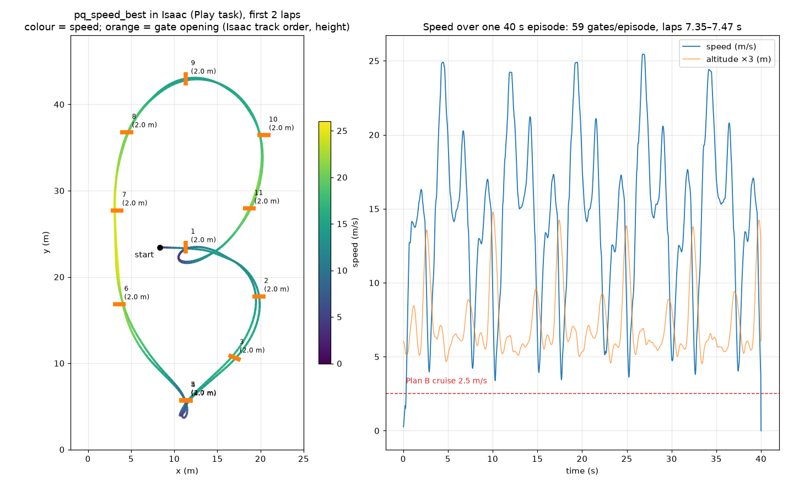

*Figure 10. `pq_speed_best` in playback on the team's original track: path over two laps coloured by speed, and speed and altitude against time. The dashed line is the fallback plan's 2.5 m/s gate speed for comparison.*

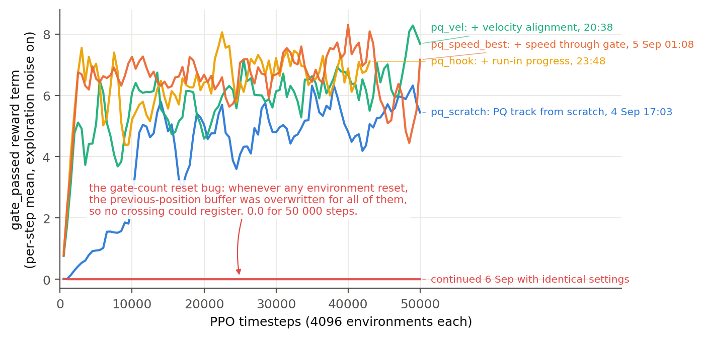

*Figure 11. The lineage that produced `pq_speed_best`, from the surviving TensorBoard logs: each run on the team's PQ track warm-started from the one before it, 4–5 September, and the continuation on 6 September with identical settings that passed no gates. The continuation was the first symptom of a reset bug: whenever any environment reset, the previous-position buffer was overwritten for all environments, so no crossing could ever be registered again. A one-line fix confirmed by an A/B test restored the gate reward from 0.01 to 1.1.*

The zero was a bug. The 59 gates were not a result either. A stress study on 16 September ran the policy on 512 aircraft while changing one thing at a time (Figure 12). On its own track it crashed 1.7 times per 100 gates. Give it the real camera's 74° field of view instead of the 90° the code assumed and that became 42. Add 50 ms of total delay: 55. Make hover thrust 10% weaker than assumed: 58. Scaling the track by the 7.5% the digitisation had lost took crashes from 2 to 16, and 60% of those happened on the climb to the double gate's upper opening; the policy had learned a manoeuvre timed to the distances it trained on. On a mirrored or random course it crashed almost at once, 73 and 47. A policy whose input names the next gate is expected to behave that way, but the numbers confirm it learned the course and not a skill. Put on the corrected simulator with the real camera, it passed four gates and crashed. Every time.

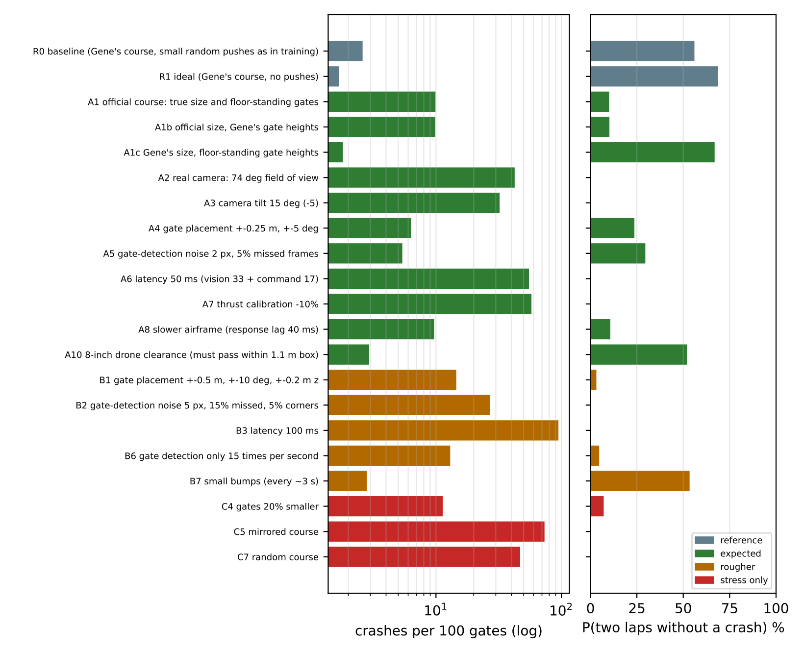

*Figure 12. Crashes per 100 gates (log scale) and the implied chance of two clean laps for `pq_speed_best` under single perturbations, grouped by how likely each is at the real event. Latency and thrust calibration dominate; the camera model is next.*

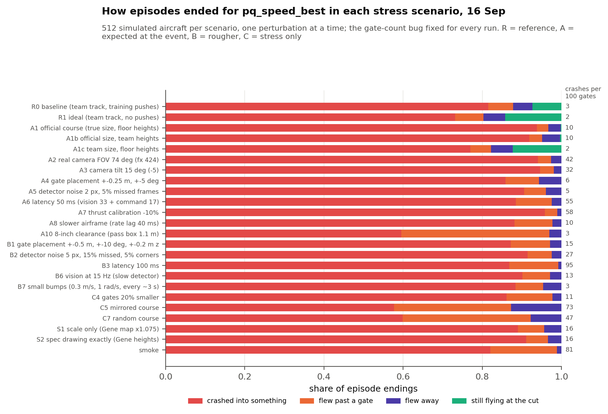

*Figure 13. How the episodes in each stress scenario ended, for `pq_speed_best` on 16 September: 512 simulated aircraft per scenario, one perturbation at a time, with the gate-count bug fixed for every run (R = reference, A = expected at the event, B = rougher, C = stress only). On the reference track a fifth of episodes were still flying when the clock ran out; under the real camera, 50 ms of delay or a 10% thrust error almost all of them ended in a collision. The two course-geometry stress rows are the exceptions: there the policy flew past gates rather than into them, the signature of a manoeuvre timed to distances that no longer held.*

A one-hour fine-tune on the corrected simulator, with the expected disturbances randomised, got through 6.3 gates per attempt at 11 crashes per 100 (Figure 14). Under the conditions it had trained on, that is ten times better. With no disturbances at all it did worse than the original, having learned to expect delay and drag. This was the evidence that argued for renting a GPU and retraining from the plant of Section 5.3 rather than patching the old policy.

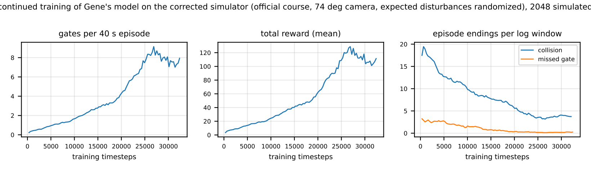

*Figure 14. Training curves of the one-hour fine-tune on the corrected simulator: gates per 40 s episode, mean total reward, and episode endings by cause.*

### 5.5 Rewards, starts and the smoke test

Six hundred points per gate passed and 20 per metre of progress toward the aim point dominate the racing reward. A −100 termination penalty, small terms for looking at and centring on the gate, and an over-speed penalty above 8 m/s round it out. The speed cap arrived after the corrected-plant policy settled at a 14 m/s median and 21 m/s at the 95th percentile with 73% of its crashes being gate strikes; two laps of 106 m need only 5.3 m/s to finish in 20 s. The hover task is a subclass. It rewards approaching a 2 m standoff in front of a gate, station-keeping, and being *settled* (within 0.30 m and under 0.30 m/s), and it terminates 8 m from the target.

Starts mattered as much as rewards. The best racing policy averaged 9.5 gates. From the real start position, on the floor 7.4 m before gate 1, it passed gate 1 in zero of 456 attempts. It had never trained a takeoff. Adding pad and floor starts then surfaced two silent bugs in a row. A spawn pose had been snapshotted before the code that set it, so 0 of 1024 spawns landed near the pad although 20% were configured. A height jitter was applied after height selection, which put 15% of floor spawns underground. With both fixed, 256 pad starts passed gate 1 86.3% of the time, median 2.15 s. A fifteen-check smoke test now gates every training run on a rented box. Its own exit code had been reporting success while failing; Isaac Sim's shutdown hard-exits before Python's `sys.exit` runs, and the buffered output goes with it.

### 5.6 Results at the rate the aircraft supports

The link supports 40 Hz, not the 60 Hz the policies trained at (Section 6.1). Figure 15 puts a price on the difference. The best 60 Hz hover checkpoint settles in 87.0% of episodes at its trained rate and in 52.6% when run at 40 Hz, its 95th-percentile excursion growing from 0.37 to 0.93 m. Pin the delay to zero and 22.6 points of the loss belong to the rate itself, 13.5 to the extra latency. The 60 Hz racing policy keeps 37% of its gates at 40 Hz. Retrained at 40 Hz, the hover policy settles 85.5% of the time with a 0.331 m 95th-percentile excursion, a better tail than the 60 Hz policy managed at its own rate, and it still settles 89.0% if run at 60 Hz.

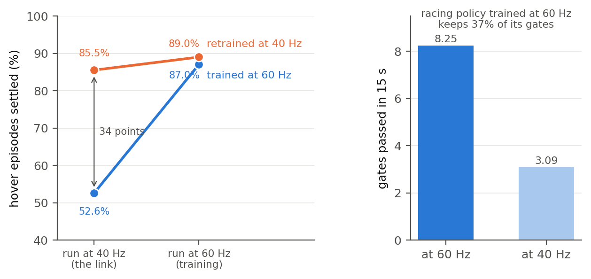

*Figure 15. The control rate is part of the plant. Left: hover settled fraction for the 60 Hz checkpoint and the 40 Hz retrain, each run at both rates (4096 episodes). Right: the 60 Hz racing checkpoint's gates in 15 s at both rates.*

Figure 16 ranks what the aircraft could get wrong, from the hover policy's point of view. How the aircraft *responds* barely matters: a slower rate filter, a lighter mass. How much thrust it *needs* matters a great deal. A four-step command delay, the direct stand-in for running a 60 Hz policy at 40 Hz, is the worst non-thrust condition at 13.0% settled. Along the way the hover policy's exploration noise turned out to be *growing* while racing's shrank. Once hover converges the task gradient goes quiet, and the entropy bonus, amplified by an adaptive learning rate whose default ceiling is 100 times the base rate, becomes the dominant pressure. Hover got its own optimiser settings. Its settled fraction went from a 68.3% peak to 77.4%, and then to 87.0%.

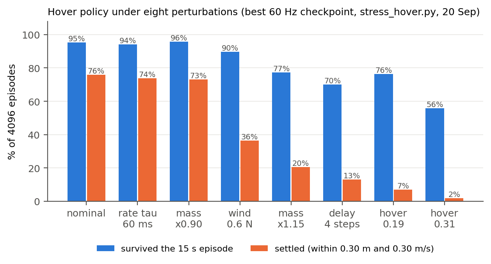

*Figure 16. The hover policy under eight perturbations: the best 60 Hz checkpoint, 4096 episodes each, 20 September. Blue is the share that survived the episode, orange the share that settled, grey the gap between them. The hover-stick rows are outside the trained band and outside what the aircraft does; they bound the failure mode rather than describe a live risk.*

Corner dropout is modelled per corner as a two-state Markov chain with the measured 13% drop rate and 0.81 stickiness (Section 4.6). Applied only at evaluation, it costs the racing policy 71% of its gates. Had the dropout been independent frame to frame at the same rate, the policy would be "ready" 0.5% of the time; the clustered real process leaves it ready 24%, so the correlation is a mercy. Trained against it, the `race40drop` chain reached 10.23 gates per episode *with corners dropping*, against `race40`'s 15.27 with perfect corners. In the one head-to-head recorded from the competition pad under measured dropout, `race40drop` scored 9.31 gates to `race40`'s 4.62. One detail from that work belongs in the contract's margin: writing dropped corners as zero instead of the "not seen" sentinel collapsed racing from 12.8 to 0.13 gates per episode.

Figure 17 is the result that the retrained chain produced on its own terms. In Isaac, from the competition pad, with the measured corner dropout applied, 36 of 64 aircraft flying `race40drop` completed the first lap. The path bundle shows where the policy is consistent (the long straights) and where it is not (the reversal at gate 6 and the climb to the double gate); the height trace shows the climb to the 4.05 m upper opening and the return to 1.35 m; and the gate-passing times show the spread growing along the lap.

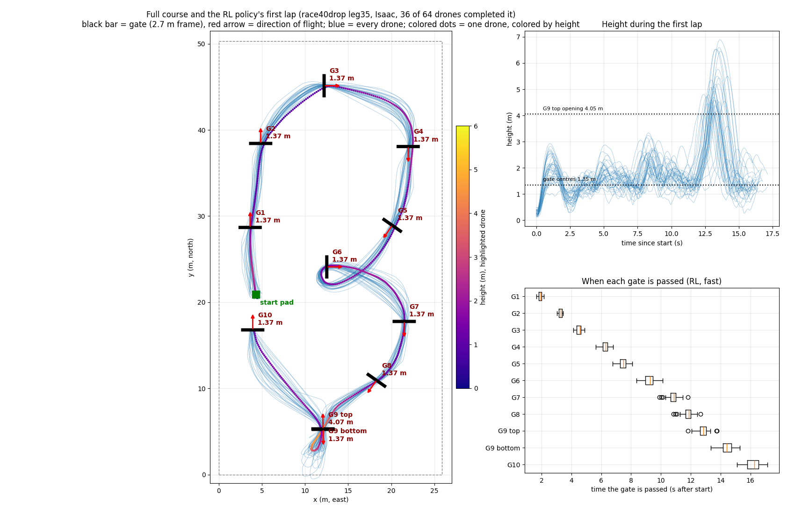

*Figure 17. The 40 Hz racing policy trained under corner dropout (`race40drop`, leg 35) flying the full course in Isaac from the competition pad; 36 of 64 aircraft completed the first lap. Left: every aircraft's path in blue, one aircraft's path coloured by height, black bars the gates and red arrows the required direction. Top right: height over the first lap against the 1.35 m gate centres and the 4.05 m upper opening of gate 9. Bottom right: when each gate was passed.*

Figure 18 is the policy's own camera during a simulated run. Figures 19 and 20 are the recordings themselves: the takeoff from the competition pad that the start fixes of Section 5.5 made possible, and the best racing checkpoint from a chase camera. They animate on GitHub; the PDF shows one frame of each with a link to the file.

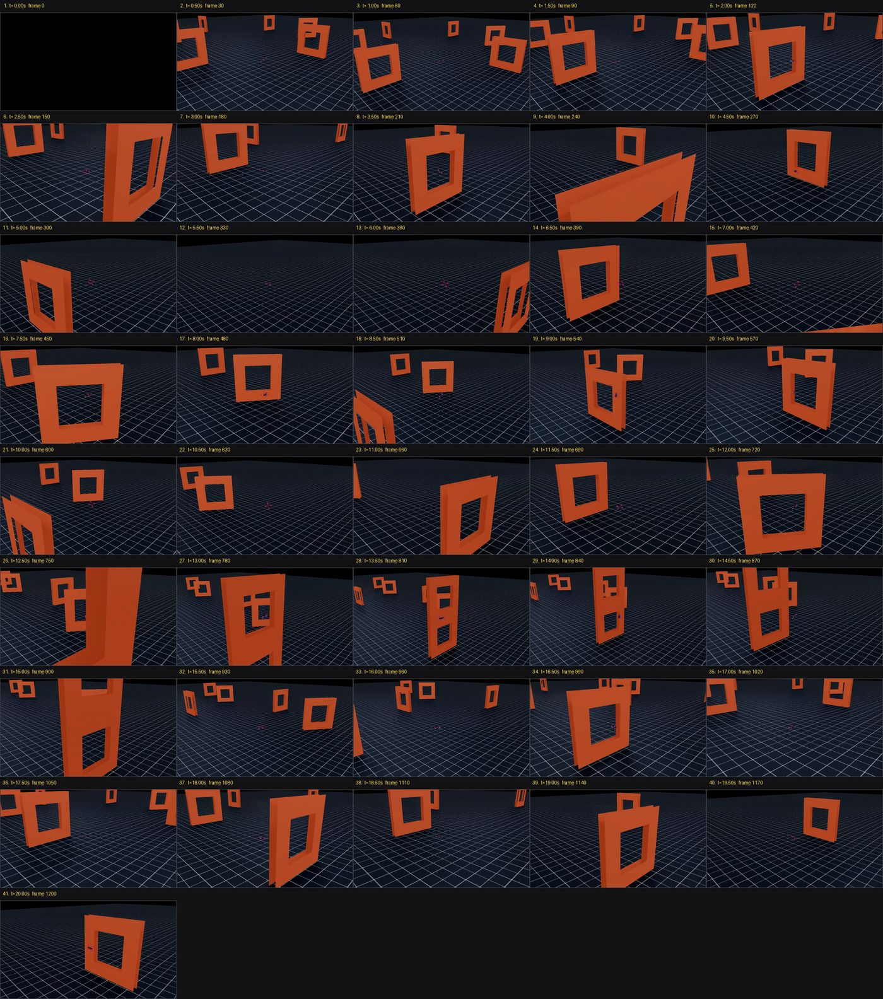

*Figure 18. Contact sheet from the onboard camera in Isaac during a racing episode, one tile every 0.5 s for 20 s.*

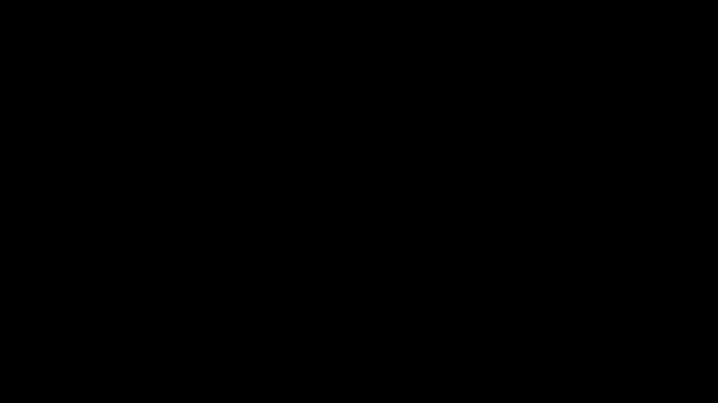

*Figure 19. The 40 Hz racing policy starting on the floor 7.4 m before gate 1 and flying through it, in Isaac ([race_start_from_pad.mp4](https://github.com/bojro/aigp-sim/blob/main/paper/videos/race_start_from_pad.mp4), 6.7 s). Before the start-distribution fixes of Section 5.5 this takeoff succeeded in zero of 456 attempts; after them, 86.3% of pad starts pass gate 1.*

*Figure 20. The best racing checkpoint on the corrected course from a chase camera ([race_best.mp4](https://github.com/bojro/aigp-sim/blob/main/paper/videos/race_best.mp4), 9.9 s).*

## 6. The aircraft, measured

Everything below was measured between 18 and 21 September with the propellers off, the aircraft never armed, and the Betaflight console untouched. Each item overturned something a runner had assumed.

### 6.1 The link runs at 40 Hz, and one message is load-bearing

Read on its own, the telemetry snapshot round-trips in 10.0 ms. That snapshot bundles attitude, raw IMU, status and RC into a single batched `MSP_MULTIPLE_MSP` request, and at 10 ms it looks good for 97 Hz. The number is a mirage. Telemetry and the stick stream share one UART, and contention grows with the stream rate (Figure 21). With a 40 Hz stream running, the 95th-percentile snapshot takes 20.3 ms against a 25 ms budget. With a 60 Hz stream it takes 30.3 ms against 16.7 ms. The wire itself explains 8.5 ms of the 10 ms floor; the rest of the degradation under load is the flight controller's MSP task scheduling rather than bandwidth, and a faster baud rate is stored configuration and therefore off limits. Nobody had exercised the batched message before this. Neither the organizers' library nor their fake flight controller implements it. Without it, four separate requests take 66.9 ms at a 40 Hz stream, fail the runner's own timing gate at every rate, and at their worst overrun the 60 ms after which the runner throws the observation away. Should a firmware change ever drop message 230, the aircraft does not slow down. It stops flying.

*Figure 21. One 115200-baud UART carries both the telemetry and the stick stream. Telemetry snapshot latency (attitude, raw IMU, status and RC in one round trip) with and without the stick stream, batched against the four-request fallback; 300 samples per condition, measured on the aircraft over USB on 21 September.*

### 6.2 The gyro speaks in counts

`MSP_RAW_IMU` returns raw 16-bit gyro counts, not degrees per second. We rotated the airframe by hand, integrated the gyro, and compared the result with the flight controller's own attitude. The ratios came out at 16.14 on pitch and −16.25 on yaw. The scale of a 16-bit gyro at 2000°/s full scale is 32768/2000, or 16.384. A hover log from 18 September had already shown a peak of 4894, impossible as degrees per second and unremarkable as counts. The deployed runner nevertheless passed the counts straight through `np.radians()`. Since the policy clips its gyro channel at ±8 rad/s, a real rotation of 28°/s saturated the observation. The organizers' library states the units correctly, calling the value "raw FC units". The comment in their IMU check script, "gyro already in deg/s", is wrong for this build, and neither of the script's checks can catch it: near-zero at rest passes either way, and a 30°/s response threshold passes more easily when the number is sixteen times too large.

### 6.3 Axis conventions

Stick readings on 21 September: roll right 2005 and left 1000; yaw right 2005 and left 997; pitch **nose-down 2005** and nose-up 997. That last pair is reversed from the usual RC convention. The flight controller labels nose-down positive on attitude, gyro and stick alike, whereas the simulator's attitude channel calls nose-up positive. Every runner written before 21 September carried pitch the other way round. The final adapter negates pitch on both command and observation; a teammate had reached the same conclusion independently the night before, from the organizers' own docstring. Yaw is stranger still. The flight controller's two messages disagree with each other: heading rose as the aircraft turned right while the yaw gyro integrated negative.

### 6.4 The rate map, or why the first policy flight ended in a wall

The deployed runner mapped body rates to sticks with a straight line, sending the policy's full ±3.2 rad/s envelope to full stick. We read the aircraft's rate profile over MSP: rc_rate 55, super rate 75, expo 0. Full stick on that profile commands 440°/s on roll and pitch and 380°/s on yaw. The policy's envelope is 183°/s, and the curve is nowhere near a line. Figure 22 shows the consequence. Loop gain starts at 0.62 for small commands, crosses unity mid-range, and reaches 2.40 at full stick. A small correction returns two-thirds of what was asked, so the policy pushes harder; past the crossover it is handed 2.4 times what it wanted. Under-respond, over-correct, diverge. The replacement adapter inverts the curve by bisection over the monotonic forward model, and on this profile, with expo at zero, the inversion is exact. The throttle map, for what it is worth, was right. The whole hover band sits inside one segment of the 12-point throttle curve with a local gain of 0.914, an 8.6% constant that the policy's thrust-to-weight randomisation already covers.

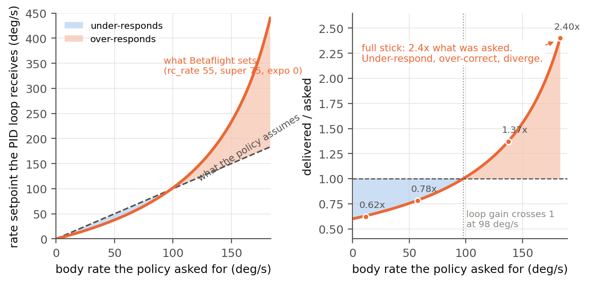

*Figure 22. The shipped linear stick map against the flight controller's rate curve. The policy's 3.2 rad/s (183°/s) envelope was sent to full stick, where this profile (rc_rate 55, super rate 75, expo 0, read off the aircraft) commands 440°/s. Every runner on this stack validated commands to the same envelope, so the finding applied to every policy, not one.*

### 6.5 The barometer, and what the first logs were worth

Four hover logs from 18 September were worthless as hover measurements. One of them reported a hover throttle of 1098 µs, 9.8%, and was the drone armed on the floor; an aircraft that hovered at 9.8% would lift ten times its own weight. The logs earned their keep in three other ways. They show the barometer falling 1.6–3.4 m whenever the propellers spin (Figure 23), with a vertical-speed output that read exactly 0.000 in all 2828 samples, so the logger's stability gate had filtered nothing. They settled the gyro units, as above. And they revealed that the logger recorded the stick and not the motor outputs, so the post-curve throttle the motors actually saw can never be recovered from them. Height, then, had to come from the camera, and every hover design from that point on depended on a gate being in view.

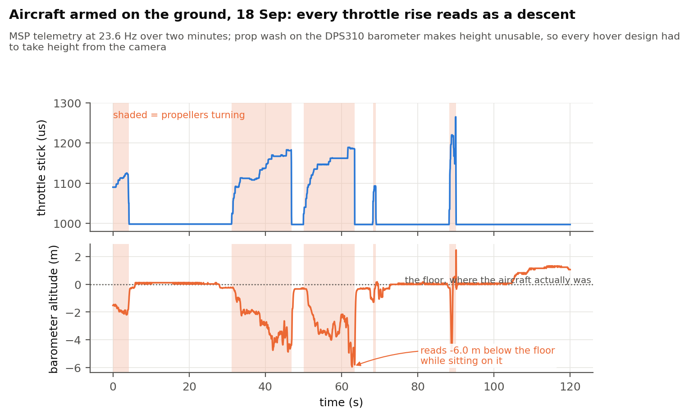

*Figure 23. Aircraft armed on the ground, 18 September: throttle stick and barometric altitude over two minutes of MSP telemetry at 23.6 Hz, with the intervals when the propellers were turning shaded. Each throttle rise reads as a descent of several metres, which is why every hover design took height from the camera.*

### 6.6 What the aircraft did with a policy in shadow

Shadow mode runs the whole chain, camera to policy, and logs the command it would have sent while transmitting nothing; a test parses the source to prove the send path is structurally unreachable. At the hover pose on 21 September, before the keypoint-threshold and history-gap fixes, the runner obtained 15 usable observations from 1262 frames. The 20° upward tilt hides both bottom corners at that pose, which is why the minimum visible corners was later lowered from four to three. Earlier still, a static observation with four visible corners had drawn a confident 1636 µs throttle command from the policy, against a hover estimate of 1233 µs. A degraded view does not produce a degraded command. It produces a confident wrong one.

## 7. Flight attempts, and what the aircraft did

No scoresheet for 21–22 September exists in any repository, and the last commit of the event is stamped 01:18 UTC on 22 September. What the record does hold is a bring-up that got close to, but never reached, an autonomous hover, and a fleet that did not survive the attempt. By the team's own account, all four aircraft were grounded by the end.

1. **18 September.** The Betaflight console wedged the flight controller on both of two attempts, each needing a battery pull, and a profile write was lost in the second wedge. Flipping the transmitter switch labelled ACRO/ANGLE "made the drone die"; the mechanism, later confirmed from source, was the override engaging on a zero stick buffer. All of that day's manual attempts were flown in ACRO, because ANGLE had been assigned to no switch, at throttle too low to leave ground effect. The logs show tip-overs and a 3.3 g ground strike, after which the firmware's runaway-takeoff protection disarmed the aircraft. Nobody on the team could hand-hover for more than a second. That evening the airframe was replaced, voiding the day's camera calibration.
2. **19 September.** The flight controller went silent again, on MSP and to the transmitter, and had to be recovered by hand. The console ban became unconditional. Plan A, the trained policy, was deferred in favour of a slow, self-levelled hover-then-one-gate plan. Motors ran with no radio bound, props off.
3. **20 September.** A Betaflight reset occurred; the configuration owner wrote a restore procedure and asked that a human run it. The battery was found at 2.55 V per cell. The first props-on policy attempt lasted 0.45 s, twenty policy samples, with the decoded collective climbing from 0.54 to the 0.90 maximum before the pilot disarmed. That evening's rate-map audit (Section 6.4) is titled "Why the first policy flight ended in a wall".
4. **21 September.** With the configurator and the Jetson attached at once, the flight controller hung. The aircraft came up armed twice, the ARM switch having been left down. The fallback stack's first flight "hit the ceiling": with the gate out of frame its takeoff trim integrated the height error and pinned the throttle at its cap, climbing at 1.0 m/s where 0.4 m/s was intended. The venue asked for extra care. A replacement Jetson appeared that night, its OpenCV missing the GStreamer camera path. Every reinforcement-learning chain was stopped, and the classical stack, which reached 95% three-gate success in the simulator it had been tuned in (Figure 24), was chosen for the final day. There is no record of it flying.

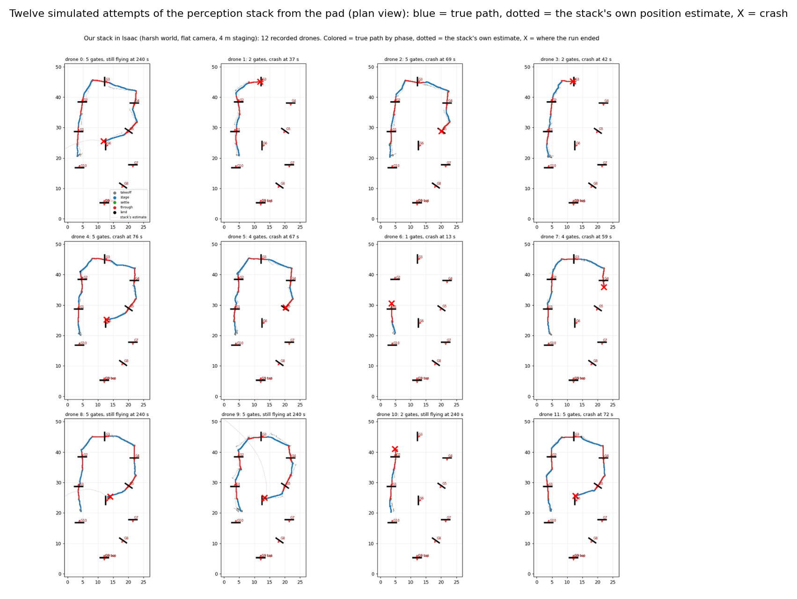

*Figure 24. The classical fallback stack, flown in Isaac against a pessimistic sensor model (every gate detected, gate-shaped false positives, sticky corner dropout, 60 ms latency, an unknown self-levelling gain). Most crashes fall between gates 5 and 6, where the course reverses.*

*Figure 25. Ten seconds of the classical stack flying in Isaac ([stack_run_02.mp4](https://github.com/bojro/aigp-sim/blob/main/paper/videos/stack_run_02.mp4), 60 s; runs [01](https://github.com/bojro/aigp-sim/blob/main/paper/videos/stack_run_01.mp4) and [03](https://github.com/bojro/aigp-sim/blob/main/paper/videos/stack_run_03.mp4) are the other two attempts). Left: Isaac's chase view. Right: the drone's own camera with the simulated detector's corners drawn, green for the target gate, cyan for other gates, red for false detections, and a status line of time, phase, gates passed, estimation error and time blind.*

What would have had to be true for a scored run? The list is short, and none of it was. A usable height sensor; the aircraft had none. Detector corners available more than 59% of the time, in gaps the policy had trained against; it had only just begun to. A link fast enough for the policies, or policies slow enough for the link; the two met only on the last day. A command path free of a 2.4× rate map, an inverted pitch axis and a yaw sign taken from the wrong message; each was present at some point, the pitch inversion on every runner until 21 September. One enablement sequence instead of three competing in the same week (ACRO with the switch first; ANGLE with arming first; ANGLE in every switch position), each adopted in turn. And a props-off handover check, the one test that proves the abort path works, run after the last change rather than deferred by choice. The team's own closing estimate for passing two gates was 30–40%, with the note that nothing in the onboard racing client had ever touched the aircraft.

## 8. The seam between software and hardware: an engineering retrospective

Section 7 lists what happened. This section asks a narrower question: of the things that went wrong, which ones went wrong *at the boundary* where software written against a simulator met a flight controller, a camera and a radio, and what do they have in common? Four patterns account for nearly all of them.

### 8.1 Every boundary crossing carried an unchecked assumption

A number crosses from the aircraft into the policy, or from the policy out to the motors, and somewhere along the way its meaning changes. Units, sign, scale, rate. Each of those was assumed at least once and each assumption was wrong at least once.

- **Units.** The gyro arrived in counts and was treated as degrees per second, a factor of 16.384 (Section 6.2). The evidence had been sitting in a log for three days: a peak reading of 4894 that no aircraft could produce in degrees per second.
- **Sign.** Pitch was carried the wrong way by every runner until the last day. A teammate's position-hold controller had the same inversion, and its unit test passed because the test's toy plant used the same wrong sign; the loop was checked against a mirror of its own error. Yaw was then derived from the gyro when the attitude message said the opposite.
- **Scale.** The policy's rate envelope (183°/s) and the flight controller's (440°/s) were different sizes, and the curve joining them was not a line. Mapping one linearly onto the other gave a loop gain from 0.62 to 2.40 (Section 6.4). Every runner on the stack inherited the same map.
- **Rate.** The policies trained at 60 Hz because that was the simulator's default. The link's 40 Hz ceiling was measured on the fourth day on site (Section 6.1), and the retrained policies arrived on the last.
- **Contract width and hover point.** A hover policy expecting 198 inputs was documented as expecting 192; a 0.255 hover stick baked into one runner was self-consistent for its own policy and would have broken both the throttle map and the velocity integrator of a policy trained to 0.225, producing about 5.6 m/s of phantom sink. Neither was a bug until a different checkpoint was dropped in.

The common thread is that none of these values was *read off the artefact*. They were read off documents, defaults and memory. Reading the gyro scale took a person rotating the airframe for three seconds; reading the rate profile took one MSP request. Both were done on day five.

### 8.2 Checks that shared a cause with the thing they checked

The team wrote a great many tests. The ones that mattered most, in hindsight, were the few that could have failed on their own.

| The check | Why it could not fail | What it hid |
|---|---|---|
| Auto-labeller accuracy, 0.75 px | scored against the geometric model the labeller solves for | 4.36 px against humans (Section 4.5) |
| Detector mAP on a random split, 0.90 | neighbouring frames are near-duplicates | 0.283 on contiguous blocks (Section 4.4) |
| The hover logger's stability gate | it gated on a vertical-speed field that read 0.000 in every sample | a "hover throttle" of 9.8% from an aircraft sitting on the floor (Section 6.5) |
| The smoke test's exit code | Isaac Sim's shutdown hard-exits before `sys.exit`, so the shell always saw 0 | a broken plant would have been green-lit for training (Section 5.5) |
| A position-hold unit test | the test plant used the same inverted pitch sign as the controller | a 0.30 m error growing to 14.9 m in 20 s under the true convention |
| The organizers' IMU check | "near zero at rest" and "responds to motion" both pass with a 16× scale error | the gyro units (Section 6.2) |
| Corner visibility at the default threshold | detection rate was measured, corner availability was not | a policy that could act 36% of the time (Section 4.6) |

The remedy in every row is the same: a second, independent route to the answer. Humans for the labeller, a bench rotation for the gyro, an authoritative `SMOKE_RESULT=` line grepped from stdout instead of a return code, a structural test that parses the source to prove shadow mode cannot transmit. Where the team built those, they held.

### 8.3 The order of operations

The bring-up ladder was written down early: bench, then props-off handover, then tethered hover, then a gate. It was then climbed out of order. The props-off handover check, which proves that flipping the override switch off returns the aircraft to the pilot, is the abort path, and it was deferred on the last day by choice while four of the things it guards changed the same night. The first props-on policy flight went to an aircraft carrying the 2.4× rate map and an inverted pitch axis; the audit that found both was written after the wall. The plan for the scored day was a single competition run with no bench run before it.

Some of that was time. Some of it was structure. Three people built three runners with three enablement sequences (ACRO with the override switch first, ANGLE with arming first, ANGLE in every switch position), and the shared documents adopted each in turn. Constants that were correct inside one runner were copied into another where they were not. The team's own briefing notes that it "leans heavily on AI coding agents" and that "some decisions live only in chat history"; the on-site working tree and the committed copy drifted, and a rule had to be written to keep them in step. A piece of software that has to be right about a piece of hardware needs one owner for each number, and that ownership was never assigned.

### 8.4 Interlocks that were documented but not enforced

The dangerous behaviours of the flight controller were all known before they cost anything. They were written in the firmware source and in the team's research notes. What was missing was code that made them impossible.

- The MSP stick buffer starts at zero and zero means a dead receiver. Every runner therefore had to stream valid frames before the switch moved. The first runners did not; the switch "killed" the aircraft; and the rule was learned from the aircraft rather than enforced by the runner.
- A stopped stream leaves the last command in force forever. Every fault path that exits the process is therefore a fault path that keeps the motors at their last setting. The team's rule became "leave the process running until the aircraft is landed"; a runner that keeps streaming a descent on every exception would have made the rule unnecessary.
- Two MSP clients on one flight controller hang it, and a configurator session sets an arming-disable flag on its own port that blocks the pilot invisibly. Both were learned by losing a session.
- The read and write orders of the RC channels differ (`MSP_RC` returns yaw before throttle; `MSP_SET_RAW_RC` takes AETR). A bench tool read AUX5 from the slot that holds AUX3, so the one test whose subject was the override switch was displaying the wrong switch.
- The aircraft came up armed twice with the ARM switch already down, and a Betaflight reset occurred once. A power-on checklist existed on paper.

The cheapest fix for all of these is the same shape: a preflight that reads the aircraft's state, refuses to continue if any of the known traps is armed, and prints what it saw. The team wrote one late on 21 September, with a hash of every file that decides what the aircraft would do, so that any change re-opens the handover check. It never flew.

### 8.5 What a second attempt would build first

In order, and before any policy is trained:

1. A bench tool that reads every constant the runner depends on directly from the aircraft, including gyro scale, rate profile, throttle curve, channel map, arming flags and link timing with the stream running, and writes them into the one configuration file the runner is allowed to read.
2. A props-off handover test bound to a hash of that file and of the runner, run by whoever changed either, with a green line that a human can read at the flight line.
3. A runner whose only exit path is a streamed descent, and which refuses to start if the aircraft is armed, another client is attached, or the override switch is already engaged.
4. One owner per number, one runner, and a change log that lives in the repository rather than a chat.
5. Only then a simulator decimation set to the measured link rate, and only then training.

## 9. Discussion

**Measure the plant before you train against it.** The stress study had ranked latency and thrust calibration above every other error source before the team reached the hall. The aircraft then delivered both surprises in exactly that order: a link half as fast as assumed, and a hover throttle never measured in free air. Five minutes with a scale and a stopwatch on day one would have been worth more than any training run.

**Self-scored accuracy is not accuracy.** The auto-labeller's 0.75 px was measured against the model it solved for; human labels, once they existed, said 4.36 px. The random train/validation split (0.517 against 0.283) was the same trap in different clothes, and so was the smoke test whose exit code could not fail. In each case the check shared a cause with the thing it checked.

**A contract that both ends hash is cheap insurance.** Channel order, sentinels and clips are the one place where a mismatch produces no error at all, only confident nonsense. The hashed contract, the parity test against the training code, and the structural test that shadow mode cannot transmit were the cheapest artefacts in the project. They also caught the most.

**The failure modes that grounded the fleet were not the ones the simulator studied.** Figure 12 contains no wedged flight controller, no zero stick buffer tripping failsafe, no mislabelled transmitter switch, no aircraft arming itself on power-up. Each of those is documented in the firmware source. Each cost an aircraft or a session. Each was preventable by a props-off bench procedure the team wrote and then, under time pressure, skipped.

**Defaults are decisions.** A keypoint threshold of 0.5, a reprojection cap of 2 px, a linear stick map, `np.radians` on raw counts, a mass applied to every link: nobody chose any of them, and all of them were flying. Section 8.1 lists what reading them off the artefact would have cost.

**What we would do next time**, in order. Weigh the aircraft, and measure hover throttle and thrust-to-weight from RPM on day one, in the cage. Measure the link rate with the stream running and set the simulator's decimation to match before renting a GPU. If the rules allow it, put a downward range sensor on the Jetson, because every hover design here died for want of height. Hand-label a hundred real frames before training anything. And never fly a runner whose handover check has not passed since the last change.

## 10. Conclusion

In five days on site, after four months of preparation, Team Electric Fire assembled a complete vision-only racing system for an aircraft it had not designed, in a hall without tracking. The simulator, the plant model, the observation contract, the detector and the bench measurements are sound, and they are published. The aircraft never flew autonomously, and when the qualifier ended there was no aircraft left to fly. The learning was not where the gap lay. It lay in the dozen assumptions between the policy's output and the motors, most of them measured only after they had already cost something. They are written down here so that nobody has to measure them again.

## Acknowledgements

The organizers' MSP library and camera toolchain on the Jetson turned the adapter from a week's work into an afternoon's. Georgia Tech's AI of Sauron team, working openly on the same airframe, supplied the reference flight-controller configuration and several negative results the team went on to confirm. The simulator builds on Kousheek Chakraborty's `isaac_drone_racer`. Most of the on-site code and documents were written with AI coding assistants (Claude, Cursor and Codex), as the commit history records.

## References

1. E. Kaufmann, L. Bauersfeld, A. Loquercio, M. Müller, V. Koltun and D. Scaramuzza, "Champion-level drone racing using deep reinforcement learning," *Nature* 620, 982–987, 2023.
2. P. Foehn, D. Brescianini, E. Kaufmann, T. Cieslewski, M. Gehrig, M. Muglikar and D. Scaramuzza, "AlphaPilot: Autonomous drone racing," *Robotics: Science and Systems*, 2020.
3. S. Li, M. M. O. I. Ozo, C. De Wagter and G. C. H. E. de Croon, "Autonomous drone race: A computationally efficient vision-based navigation and control strategy," *Robotics and Autonomous Systems* 133, 2020.
4. Y. Song, M. Steinweg, E. Kaufmann and D. Scaramuzza, "Autonomous drone racing with deep reinforcement learning," *IEEE/RSJ IROS*, 2021.
5. M. Mittal et al., "Orbit: A unified simulation framework for interactive robot learning environments," *IEEE Robotics and Automation Letters* 8(6), 2023 (Isaac Lab).
6. A. Serrano-Muñoz, D. Chrysostomou, S. Bøgh and N. Arana-Arexolaleiba, "skrl: Modular and flexible library for reinforcement learning," *Journal of Machine Learning Research* 24, 2023.
7. J. Schulman, F. Wolski, P. Dhariwal, A. Radford and O. Klimov, "Proximal policy optimization algorithms," arXiv:1707.06347, 2017.
8. J. Eschmann, D. Albani and G. Loianno, "Learning to fly in seconds," *IEEE Robotics and Automation Letters*, 2024.
9. P. Foehn et al., "Agilicious: Open-source and open-hardware agile quadrotor for vision-based flight," *Science Robotics* 7(67), 2022.
10. K. Chakraborty, *isaac_drone_racer*, https://github.com/kousheekc/isaac_drone_racer, 2025.
11. G. Jocher, A. Chaurasia and J. Qiu, *Ultralytics YOLOv8*, https://github.com/ultralytics/ultralytics, 2023.
12. D. Hafner, J. Pasukonis, J. Ba and T. Lillicrap, "Mastering diverse domains through world models," arXiv:2301.04104, 2023 (DreamerV3).
13. M. Kelly, C. Sidrane, K. Driggs-Campbell and M. J. Kochenderfer, "HG-DAgger: Interactive imitation learning with human experts," *IEEE ICRA*, 2019.
14. Betaflight, firmware 4.4.3, https://github.com/betaflight/betaflight.
15. Drone Champions League and Anduril, *AI Grand Prix Physical Qualifier Technical Specification*, VADR-TS-005 issue 00.02, 3 September 2026.

## Appendix A. Where things are

| What | Where |
|---|---|
| Simulator, plant, observation contract, PPO training, pod scripts | `bojro/aigp-sim` (`contract/`, `tasks/`, `dynamics/`, `utils/`, `scripts/`, `docs/`) |
| Auto-labeller, hybrid labeller, dataset tools, training recipes, ONNX deployment, the shipped models | `bojro/aigp-perception` (`aigp_perception/`, `datasets/`, `train/`, `eval/`, `deploy/`, `models/`) |
| On-site work: specification and facts, NumPy flight stack, bench tools, measurements, runners, research notes | `Code-Red-Cables/AI_GP` under `pq/` (private) |
| The four eras before the physical qualifier | `bojro/AI_GP-archive`, sixteen branches (private) |
| This paper, its figures and the videos | `bojro/aigp-sim/paper/` |

## Appendix B. Numbers in one place

| Quantity | Value | How it was obtained |
|---|---|---|
| Aircraft mass | 1745 g | scale, 17 Sep |
| Camera focal length at 640 px | ≈425 px (73.7–74.1° HFOV) | three calibrations of the lens |
| Camera tilt | 20° up, locked | set 17 Sep |
| Telemetry snapshot p95, 40 Hz stream | 20.28 ms (budget 25) | 300 samples, 21 Sep |
| Telemetry snapshot p95, 60 Hz stream | 30.30 ms (budget 16.7) | same |
| Gyro scale | 16.384 counts per °/s (measured 16.14, 16.25) | integration against attitude |
| Rate profile | rc_rate 55, super 75, expo 0 → 440°/s full stick | `MSP_RC_TUNING` |
| Policy rate envelope | 3.2 rad/s = 183°/s | action decoder |
| Linear-map loop gain | 0.62× at 0.2 rad/s, 2.40× at 3.2 rad/s | computed from the profile |
| Hover stick | 0.21–0.29 band in training; 0.233 observed once; 0.30–0.36 on the final airframe | never measured in free air |
| Detector inference on Orin | 27.4–27.6 ms (36 fps), 25 W | `bench_torch.py` |
| Keypoint threshold | 0.25 (was 0.5 by default): policy ready 59% vs 36% | 1345 frames at a gate |
| Corner dropout model | drop 0.13, sticky 0.81, 4.2% flip rate | same |
| Labeller accuracy | 0.75 px self-scored; 4.36 px median vs humans | 340 hand-labelled frames |
| Fine-tune on hybrid labels | box mAP50-95 0.283 → 0.636; pose 0.760 → 0.854 | contiguous-block split |
| Split leakage | 0.517 random vs 0.283 blocks | same model |
| Close-gate recall, hand labels | 71.9% → 100% (32/32) | 67 held-out frames |
| Hover settled, 60 Hz policy | 87.0% at 60 Hz, 52.6% at 40 Hz | 4096 episodes, 15 s |
| Hover settled, 40 Hz retrain | 85.5% at 40 Hz (p95 0.331 m), 89.0% at 60 Hz | same |
| Racing at 40 Hz vs 60 Hz | 3.09 vs 8.25 gates in 15 s (37% kept) | 60 Hz checkpoint |
| Racing, perfect corners | 15.27 gates/episode (`race40`) | training metric |
| Racing, corners dropping | 10.23 gates/episode (`race40drop`) | training metric |
| Pad start to gate 1 | 0/456 before start fixes; 86.3% after, median 2.15 s | `diag_takeoff.py` |
| Full racing run cost | ≈48 min, ≈$0.70 at 4096 envs | RTX 6000 Ada |
